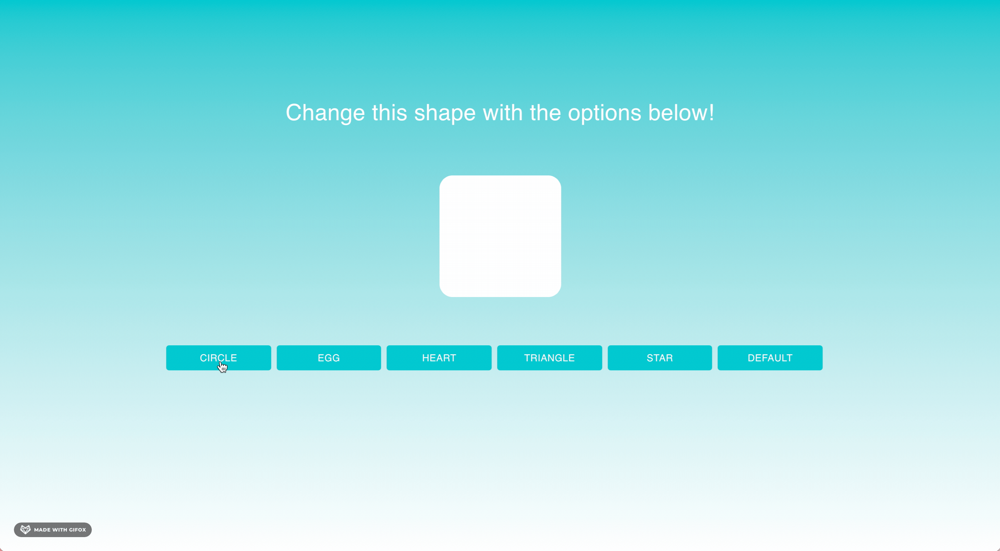

# Shape Changer

[shape-changer.paulina.tech](https://shape-changer.paulina.tech/)

This app allows a user to change a default shape with diffrent options. The project was created with Create React App and a minimal setup custom template. [Material-UI](https://material-ui.com/) and [Framer-Motion](https://www.framer.com/motion/) has also been used in order to minimize CSS coding and to simplify responsive layout.

